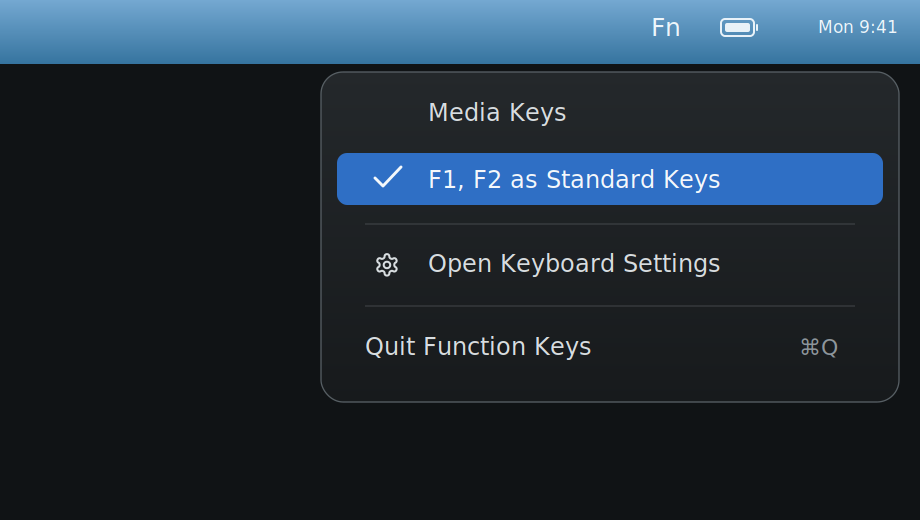

# Function Keys



A tiny macOS menu bar app for viewing and toggling whether `F1`, `F2`, etc. behave as standard function keys.

Requires macOS 13 or later.

The app has no Dock window. It lives in the menu bar and shows:

- Fn when standard function keys are enabled.
- ~~Fn~~ when the hardware/media actions are primary.

The menu shows both modes and places the checkmark next to the current state.

## Run

```sh
swift run FunctionKeys
```

That starts the development executable. For normal use, build the `.app` bundle instead so it runs as a menu-bar-only app with no Dock icon.

## Build

```sh
./scripts/build-app.sh
```

The app bundle is written to `dist/Function Keys.app`.

The build script ad-hoc signs the app locally. It does not create a notarized release build.

If you use Bartender, look for the item named `Function Keys`. The menu-bar icon changes with the active mode, but the bundle identity and accessibility label are stable so Bartender can recognize it as the same utility.

The app checks the macOS preference every 30 seconds so it can notice changes made directly in System Settings.

## Setting

The app reads and writes the same global macOS preference controlled by System Settings:

```sh
com.apple.keyboard.fnState
```

## Privacy

Function Keys does not collect data, access the network, or store app-specific settings. It only reads and writes the macOS `com.apple.keyboard.fnState` preference.

## License

MIT
